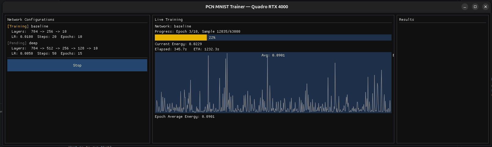

# PCN-CUDA-MNIST

A GPU-accelerated **Predictive Coding Network** for MNIST digit classification, built with CUDA and an interactive ImGui-based GUI for real-time training visualization.

Predictive coding is a neurobiologically-inspired learning algorithm where each layer generates predictions of the layer below, and learning is driven by minimizing prediction errors — no backpropagation required.

## Features

- **Full CUDA acceleration** — all inference and weight updates run on the GPU
- **Interactive GUI** — real-time energy curves, progress bars, per-digit accuracy breakdowns
- **Multi-architecture training** — define and compare multiple network architectures side-by-side
- **YAML configuration** — easily customize network depth, width, learning rate, and training parameters
- **Auto-download** — MNIST dataset is fetched automatically on first run

## How It Works

### The Predictive Coding Algorithm

Unlike standard neural networks that use backpropagation, predictive coding networks learn by minimizing prediction errors at each layer:

1. **Clamp** input layer to the image and output layer to the one-hot label
2. **Iterate** inference steps to settle hidden layer activities:
   - Each layer predicts the activity of the layer below
   - Prediction errors propagate both bottom-up and top-down
   - Hidden units update: `mu_l += lr * (-epsilon_l + W_{l+1}^T * epsilon_{l+1})`
3. **Update** weights using a local Hebbian rule: `W_l += lr * epsilon_l * mu_{l-1}^T`

The total **energy** (sum of squared prediction errors across all layers) decreases during training and is plotted live in the GUI.

### Architecture

```
src/
  main.cpp              # Entry point, config loading, training orchestration
  gpu_check.h / .cu     # CUDA device detection and selection
  mnist_loader.h / .cpp # MNIST download, decompression, and parsing
  pcn/
    network.h           # PCN network interface
    network.cu          # CUDA kernels and training implementation (13 kernels)
  ui/
    app_window.h        # UI state structures
    app_window.cpp      # ImGui application (GLFW + OpenGL 3.3)
scripts/
  run.sh                # Runtime launcher with GPU checks
  package.sh            # Packaging script (creates distributable tarball)
config.yaml             # Network architecture definitions
```

## Requirements

| Requirement | Version |
|---|---|
| OS | Linux |
| GPU | NVIDIA, Compute Capability 7.5+ (Turing or newer) |
| NVIDIA Driver | 525+ |
| CUDA Toolkit | 11.8+ |
| CMake | 3.20+ |
| C++ Compiler | C++17 support (GCC or Clang) |
| OpenGL | 3.3+ (mesa dev headers) |

On Ubuntu/Debian, install system dependencies:

```bash
sudo apt install build-essential cmake libgl1-mesa-dev libxrandr-dev libxinerama-dev libxcursor-dev libxi-dev
```

## Build

```bash
mkdir -p build && cd build
cmake .. -DCMAKE_BUILD_TYPE=Release
make -j$(nproc)
```

All library dependencies (GLFW, ImGui, yaml-cpp) are fetched automatically via CMake FetchContent.

## Run

```bash
# From the project root
./build/pcn-mnist

# Or with a custom config file
./build/pcn-mnist /path/to/config.yaml

# Or use the launcher script (includes GPU checks)
./scripts/run.sh
```

On first run, MNIST (~50 MB) is automatically downloaded to `./data/`.

## Configuration

Network architectures are defined in `config.yaml`:

```yaml
networks:
  - name: "baseline"
    layers: [784, 256, 10]         # Input (28x28) -> Hidden -> Output (10 digits)
    learning_rate: 0.01
    inference_steps: 20
    epochs: 10

  - name: "deep"
    layers: [784, 512, 256, 128, 10]
    learning_rate: 0.005
    inference_steps: 50
    epochs: 15
```

| Parameter | Description |
|---|---|
| `layers` | Layer sizes. First must be 784 (MNIST), last must be 10 (digits) |
| `learning_rate` | Step size for weight updates |
| `inference_steps` | Number of iterations to settle hidden activities per sample |
| `epochs` | Full passes over the training set |

## GUI Layout

The application window is split into three panels:

- **Left (30%)** — Network configurations with status indicators (Pending / Training / Done / Error)
- **Center (50%)** — Live training view: progress bars, epoch/sample counters, ETA, and a real-time energy curve
- **Right (20%)** — Results: overall accuracy and expandable per-digit breakdown. Best network is highlighted

Click **"Train All"** to begin training all configured networks sequentially. Use **"Stop"** to interrupt.



## Distribution

To package the application as a standalone tarball:

```bash
./scripts/package.sh
# Creates: dist/pcn-mnist-bundle.tar.gz
```

To run the packaged version:

```bash
tar xzf pcn-mnist-bundle.tar.gz
cd dist
./run.sh
```

## Expected Results

| Network | Typical Accuracy |
|---|---|
| baseline (784-256-10) | ~97% |
| deep (784-512-256-128-10) | ~98% |

## References

- Rao, R. P., & Ballard, D. H. (1999). *Predictive coding in the visual cortex: a functional interpretation of some extra-classical receptive-field effects.* Nature Neuroscience.
- Whittington, J. C., & Bogacz, R. (2017). *An approximation of the error backpropagation algorithm in a predictive coding network with local Hebbian synaptic plasticity.* Neural Computation.

## License

See [LICENSE](LICENSE) if available.
